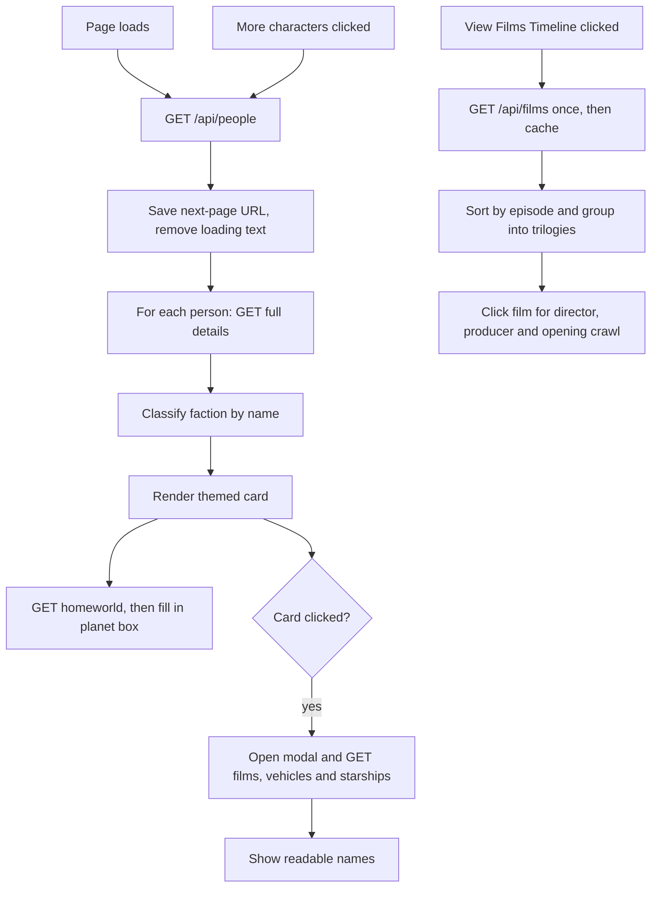

<div align="center">

# 📡 Holocron Explorer

### A Star Wars character archive and saga timeline, built live on SWAPI

*Browse the galaxy's heroes, villains and scoundrels. Dig into their ships, homeworlds and films.*


</div>

---

## 📖 About

**Holocron Explorer** is a single-page web app that turns the [Star Wars API (SWAPI)](https://swapi.tech/) into an interactive character encyclopedia. Characters load as glowing, faction-coloured cards. Click one to see every film they appear in and every vehicle or starship they have piloted, or open the **Saga Timeline** to explore all the films, grouped by trilogy, with directors, producers and the full opening crawl.

Everything is fetched live from the API, assembled in the browser, and written in **plain HTML, CSS and JavaScript**: no frameworks, no build tools, no dependencies.

## ✨ Features

| Feature | What it does |
|---|---|
| 🃏 **Character cards** | Each card shows height, mass, gender, eye colour and hair colour, with a small colour swatch next to the eye and hair values. |
| 🪐 **Homeworld lookup** | Every card lazily loads its character's home planet, with climate and terrain, without blocking the rest of the card from appearing. |
| 🔴🔵 **Faction colour-coding** | Characters are tagged **Empire / Sith** (red), **Rebellion / Jedi** (cyan) or **Independent** (grey), with matching card borders, hover glows, badges and a legend at the top. |
| 🔍 **Character detail popup** | Click a card to open a modal that resolves the character's film URLs and vehicle and starship URLs into readable names. |
| 🎬 **Saga timeline** | A popup listing every film sorted by episode number and grouped into *Prequel*, *Original* and *Sequels & Others*. |
| 📜 **Film detail view** | Click a film to see the director, producer, release date and opening crawl, with a back button to return to the timeline. |
| ➕ **Pagination** | A "More characters" button follows the API's `next` link to load the next batch, and hides itself when there are no more pages. |
| ⚡ **Cached timeline** | The films are fetched once, then reused every time you reopen the timeline. |

## 🧰 Tech Stack

| Technology | Used for |
|---|---|
| **HTML5** | Page skeleton: header, faction legend, card container, pagination button, and two modal overlays (character details and film timeline). |
| **CSS3** | Starfield background from a repeating `radial-gradient`, flexbox card grid that wraps responsively, hover lift-and-glow transitions, themed variants (`.theme-dark`, `.theme-light`) for faction colours, pill-shaped badges, full-screen modal overlays with `position: fixed` and `inset: 0`, scrollable modal variant for long content. |
| **Vanilla JavaScript** | All behaviour: data fetching, DOM construction, modal control, timeline grouping, pagination. Mixes classic `var` and `function` callbacks with modern arrow functions, `const`, and template literals. |
| **Fetch API** | Every network call, wrapped in one small reusable `get(url, callback)` helper. |
| **DOM API** | Cards are built with `createElement`, filled via `innerHTML`, and wired up with `addEventListener`. |
| **[SWAPI (swapi.tech)](https://swapi.tech/)** | The only data source: people, planets, films, vehicles and starships. |

## 🧠 How It Works



**Notable techniques**

- **Two-step loading.** SWAPI's list endpoint only returns names and URLs, so the app fetches each person's full record separately, then fetches their homeworld in a third, non-blocking request. Cards appear as soon as their own data is ready.
- **Resolving linked resources.** A character's films, vehicles and starships are stored as arrays of URLs. The `fetchNames()` helper fetches each URL in parallel and joins the resulting titles or names into one list, using a completion counter to know when every request has finished.
- **Colour mapping.** The API describes colours as text (`"blond"`, `"brown, grey"`). `getCssColor()` takes the first keyword and looks it up in a `colorMap` of hand-picked hex values (falling back to the raw word, which works for standard CSS colour names such as `blue`), and uses grey when the data is missing.
- **Faction classification.** `getAffiliation()` matches the character's name against two curated lists and returns a label plus the CSS classes that theme the card and badge.
- **Timeline grouping.** Films are sorted by `episode_id`, then filtered into Episodes 1-3, 4-6 and 7+, so new entries from the API automatically land in the right group.
- **One modal pattern, two uses.** Both popups close from the × button or by clicking the dark backdrop.

## 🗂️ Project Structure

```
holocron-explorer/
├── index.html    # Layout, legend, card container, two modal overlays
├── style.css     # Theme, cards, faction colours, modals, timeline
├── script.js     # SWAPI requests, card rendering, modals, timeline logic
├── README.md
├── LICENSE
└── .gitignore
```

## 🚀 Getting Started

No installation needed. Clone the repo and serve it with any static server:

## ⚠️ Known Limitations

- **No error handling on requests.** If SWAPI is slow or down, the loading text may stay visible and cards may not appear.
- **Mixed interface language.** Card labels (*Taille, Masse, Genre, Yeux, Cheveux*) are in French while the rest of the interface is in English.
- **Faction labels are hand-curated.** Only characters listed by name in `script.js` get a Rebellion or Empire label. Everyone else shows as Independent.
- **Modal lists may not be in canonical order.** Names are added as each request finishes, so the order can vary between opens.

## 🛣️ Roadmap

- [ ] Error handling and retry for failed requests
- [ ] Search and faction filter
- [ ] Loading skeletons instead of text placeholders
- [ ] Consistent language, or an EN/FR switcher
- [ ] Planets, species and starships as browsable sections
- [ ] Keyboard and screen-reader accessibility for cards and modals
- [ ] Favourite characters saved in the browser

## 🙏 Credits

- **[SWAPI (swapi.tech)](https://swapi.tech/)** for the Star Wars data
- Built as a learning project to practise asynchronous JavaScript, REST APIs and DOM manipulation

## ⚖️ Disclaimer

This is an unofficial, non-commercial fan project and is **not affiliated with, endorsed by, or sponsored by Lucasfilm Ltd., Disney, or any Star Wars rights holder.** Star Wars and all related names and characters are trademarks and copyrights of their respective owners.

## 📄 License

The source code is released under the [MIT License](LICENSE). The license covers the code only, not any Star Wars trademarks or content returned by the API.

---

<div align="center">

*Do. Or do not. There is no try.* ✨

</div>
